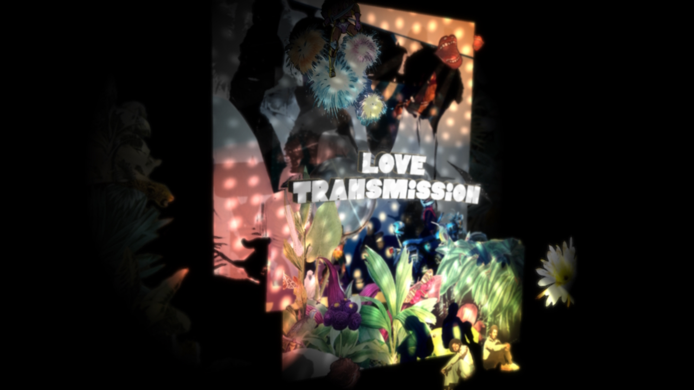

# loveposters

A modest yet powerful tool for real-time audioreactive posters. Aimed for personal use, but free for anyone to use and expected to be in development for future parties I will be hosting.

This application depends on [NAP 0.6](https://github.com/napframework) and the new `naprenderadvanced` module which has not been publicly released yet. Please reach out to me if you are interested in using this software and I will consider backporting or publishing a Windows binary. Otherwise, `naprenderadvanced` should be out soon.

Other module dependencies:
- [napappgui](https://github.com/naivisoftware/napappgui)
- [napfft](https://github.com/lshoek/napfft)

## Recent projects
- https://www.instagram.com/love.transmission/
